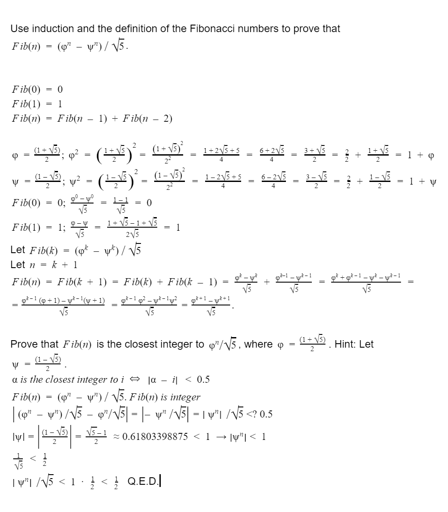

# Exercise 1.13
Prove that __Fib(n)__ is the closest integer to __phi^n/sqrt(5)__,
where __phi = (1 + sqrt(5))/2__. Hint: Let
__psi = (1 - sqrt(5))/2__. Use induction and the definition of
the Fibonacci numbers (see section 1.2.2) to prove that
__Fib(n) = (phi^n - psi^n)/sqrt(5)__.

